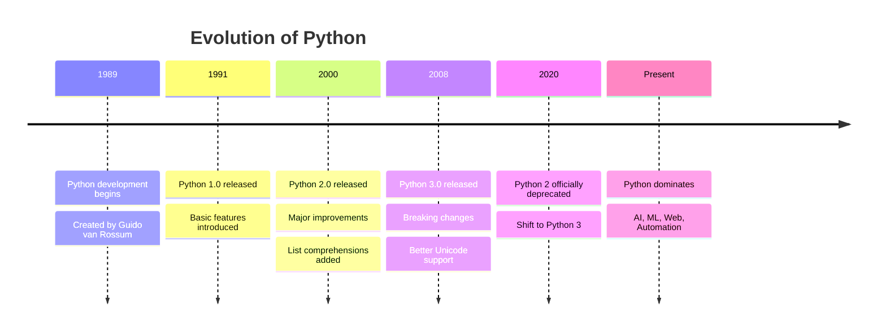

# History of Python

---

## Introduction

Python is a high-level, interpreted programming language known for its simplicity, readability, and versatility. Today, it powers everything from web development and automation to artificial intelligence and data science.

---

## Origin of Python

Python was created by **Guido van Rossum** in the late 1980s.

- Development started: **1989**
- First release: **1991**

Goal:
- Simple
- Readable
- Powerful

---

## Why the Name "Python"?

Python is named after:

**Monty Python’s Flying Circus**

Not the snake

---

## Evolution of Python

### Python 1.x (1991)
- First release
- Core features: functions, exceptions, basic data types

### Python 2.x (2000)
- List comprehensions
- Garbage collection
- Faster performance

End of Life: **January 1, 2020**

### Python 3.x (2008 – Present)
- Cleaner syntax
- Unicode support
- Better consistency

---

## Timeline Diagram



---

## Why Python Became Popular

### Easy to Learn
- Clean, readable syntax  

### Versatile
- Web, AI, ML, Data Science, Automation  

### Strong Community
- Huge ecosystem of libraries  

### Cross-Platform
- Works on Windows, macOS, Linux  

---

## Major Use Cases

- Web Development (Django, Flask)  
- Machine Learning (TensorFlow, PyTorch)  
- Data Science (Pandas, NumPy)  
- Automation  
- Game Development  

---

## Companies Using Python

- Google  
- Netflix  
- Instagram  
- Spotify  
- Amazon  

---

## Philosophy of Python

The Zen of Python  

```python
import this
```

### Key ideas:

- Simple is better than complex  
- Readability counts  
- Explicit is better than implicit  

---

## Conclusion

Python started as a simple idea:

	Make programming human-friendly  

Today, it is one of the most powerful languages in the world.
